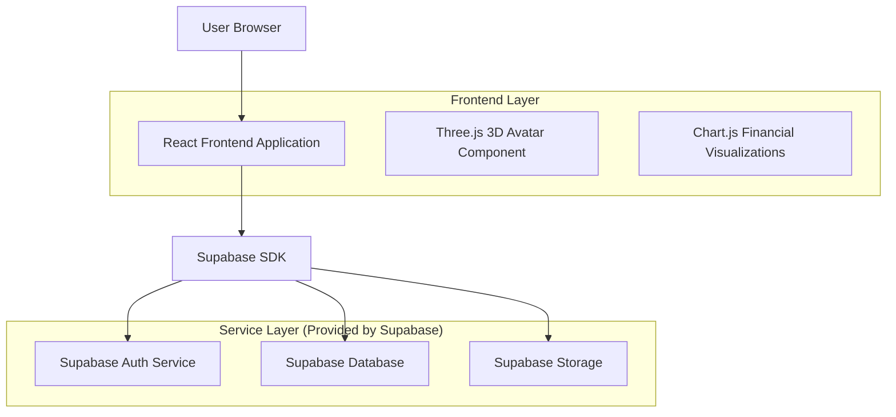
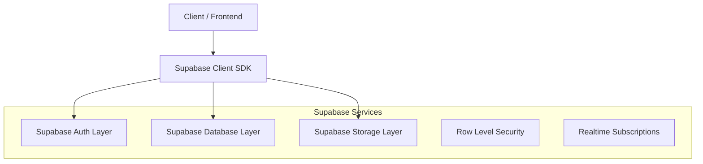
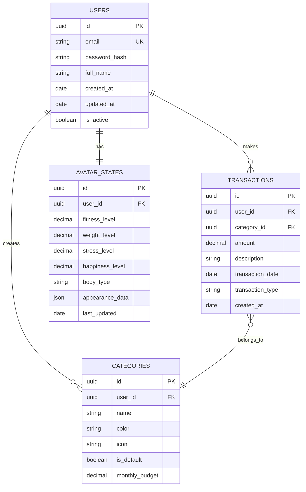

## 1.Architecture design



## 2.Technology Description

* Frontend: React\@18 + TypeScript + tailwindcss\@3 + vite

* 3D Graphics: Three.js + React Three Fiber

* Charts: Chart.js + react-chartjs-2

* Backend: Supabase (Authentication, PostgreSQL Database, File Storage)

* State Management: React Context + useReducer

* Form Handling: React Hook Form + Zod validation

## 3.Route definitions

| Route         | Purpose                                                 |
| ------------- | ------------------------------------------------------- |
| /             | Landing page with app overview and login/signup         |
| /dashboard    | Main dashboard showing 3D avatar and financial overview |
| /transactions | Transaction management and categorization               |
| /profile      | User profile and avatar customization                   |
| /analytics    | Detailed spending analytics and trends                  |
| /settings     | App settings and preferences                            |

## 4.API definitions

### 4.1 Authentication APIs

```
POST /auth/v1/token
```

Request (via Supabase client):

| Param Name | Param Type | isRequired | Description        |
| ---------- | ---------- | ---------- | ------------------ |
| email      | string     | true       | User email address |
| password   | string     | true       | User password      |

### 4.2 Transaction APIs

```
GET /rest/v1/transactions
```

Query Parameters:

| Param Name | Param Type | isRequired | Description        |
| ---------- | ---------- | ---------- | ------------------ |
| user\_id   | uuid       | true       | Filter by user ID  |
| category   | string     | false      | Filter by category |
| date\_from | date       | false      | Start date filter  |
| date\_to   | date       | false      | End date filter    |

### 4.3 Avatar State APIs

```
GET /rest/v1/avatar_states
```

Query Parameters:

| Param Name | Param Type | isRequired | Description       |
| ---------- | ---------- | ---------- | ----------------- |
| user\_id   | uuid       | true       | Filter by user ID |

## 5.Server architecture diagram



## 6.Data model

### 6.1 Data model definition



### 6.2 Data Definition Language

User Table (users)

```sql
-- create table
CREATE TABLE users (
    id UUID PRIMARY KEY DEFAULT gen_random_uuid(),
    email VARCHAR(255) UNIQUE NOT NULL,
    password_hash VARCHAR(255) NOT NULL,
    full_name VARCHAR(100) NOT NULL,
    created_at TIMESTAMP WITH TIME ZONE DEFAULT NOW(),
    updated_at TIMESTAMP WITH TIME ZONE DEFAULT NOW(),
    is_active BOOLEAN DEFAULT true
);

-- create index
CREATE INDEX idx_users_email ON users(email);
CREATE INDEX idx_users_created_at ON users(created_at DESC);
```

Transactions Table (transactions)

```sql
-- create table
CREATE TABLE transactions (
    id UUID PRIMARY KEY DEFAULT gen_random_uuid(),
    user_id UUID NOT NULL REFERENCES users(id) ON DELETE CASCADE,
    category_id UUID NOT NULL,
    amount DECIMAL(10,2) NOT NULL CHECK (amount >= 0),
    description TEXT,
    transaction_date DATE NOT NULL,
    transaction_type VARCHAR(20) NOT NULL CHECK (transaction_type IN ('income', 'expense')),
    created_at TIMESTAMP WITH TIME ZONE DEFAULT NOW()
);

-- create index
CREATE INDEX idx_transactions_user_id ON transactions(user_id);
CREATE INDEX idx_transactions_category_id ON transactions(category_id);
CREATE INDEX idx_transactions_date ON transactions(transaction_date DESC);
```

Categories Table (categories)

```sql
-- create table
CREATE TABLE categories (
    id UUID PRIMARY KEY DEFAULT gen_random_uuid(),
    user_id UUID REFERENCES users(id) ON DELETE CASCADE,
    name VARCHAR(50) NOT NULL,
    color VARCHAR(7) DEFAULT '#3B82F6',
    icon VARCHAR(50) DEFAULT 'category',
    is_default BOOLEAN DEFAULT false,
    monthly_budget DECIMAL(10,2) DEFAULT 0.00,
    created_at TIMESTAMP WITH TIME ZONE DEFAULT NOW()
);

-- create index
CREATE INDEX idx_categories_user_id ON categories(user_id);
```

Avatar States Table (avatar\_states)

```sql
-- create table
CREATE TABLE avatar_states (
    id UUID PRIMARY KEY DEFAULT gen_random_uuid(),
    user_id UUID UNIQUE NOT NULL REFERENCES users(id) ON DELETE CASCADE,
    fitness_level DECIMAL(3,2) DEFAULT 0.50 CHECK (fitness_level >= 0 AND fitness_level <= 1),
    weight_level DECIMAL(3,2) DEFAULT 0.50 CHECK (weight_level >= 0 AND weight_level <= 1),
    stress_level DECIMAL(3,2) DEFAULT 0.50 CHECK (stress_level >= 0 AND stress_level <= 1),
    happiness_level DECIMAL(3,2) DEFAULT 0.50 CHECK (happiness_level >= 0 AND happiness_level <= 1),
    body_type VARCHAR(20) DEFAULT 'average',
    appearance_data JSONB DEFAULT '{}',
    last_updated TIMESTAMP WITH TIME ZONE DEFAULT NOW()
);

-- create index
CREATE INDEX idx_avatar_states_user_id ON avatar_states(user_id);
```

### 6.3 Row Level Security Policies

```sql
-- Enable RLS
ALTER TABLE users ENABLE ROW LEVEL SECURITY;
ALTER TABLE transactions ENABLE ROW LEVEL SECURITY;
ALTER TABLE categories ENABLE ROW LEVEL SECURITY;
ALTER TABLE avatar_states ENABLE ROW LEVEL SECURITY;

-- Grant permissions
GRANT SELECT ON users TO anon;
GRANT ALL PRIVILEGES ON users TO authenticated;
GRANT SELECT ON transactions TO anon;
GRANT ALL PRIVILEGES ON transactions TO authenticated;
GRANT SELECT ON categories TO anon;
GRANT ALL PRIVILEGES ON categories TO authenticated;
GRANT SELECT ON avatar_states TO anon;
GRANT ALL PRIVILEGES ON avatar_states TO authenticated;

-- Create policies
CREATE POLICY "Users can view own profile" ON users FOR SELECT USING (auth.uid() = id);
CREATE POLICY "Users can update own profile" ON users FOR UPDATE USING (auth.uid() = id);

CREATE POLICY "Users can view own transactions" ON transactions FOR SELECT USING (auth.uid() = user_id);
CREATE POLICY "Users can create own transactions" ON transactions FOR INSERT WITH CHECK (auth.uid() = user_id);
CREATE POLICY "Users can update own transactions" ON transactions FOR UPDATE USING (auth.uid() = user_id);
CREATE POLICY "Users can delete own transactions" ON transactions FOR DELETE USING (auth.uid() = user_id);

CREATE POLICY "Users can view own categories" ON categories FOR SELECT USING (auth.uid() = user_id OR is_default = true);
CREATE POLICY "Users can create own categories" ON categories FOR INSERT WITH CHECK (auth.uid() = user_id);
CREATE POLICY "Users can update own categories" ON categories FOR UPDATE USING (auth.uid() = user_id);
CREATE POLICY "Users can delete own categories" ON categories FOR DELETE USING (auth.uid() = user_id);

CREATE POLICY "Users can view own avatar state" ON avatar_states FOR SELECT USING (auth.uid() = user_id);
CREATE POLICY "Users can update own avatar state" ON avatar_states FOR UPDATE USING (auth.uid() = user_id);
```

