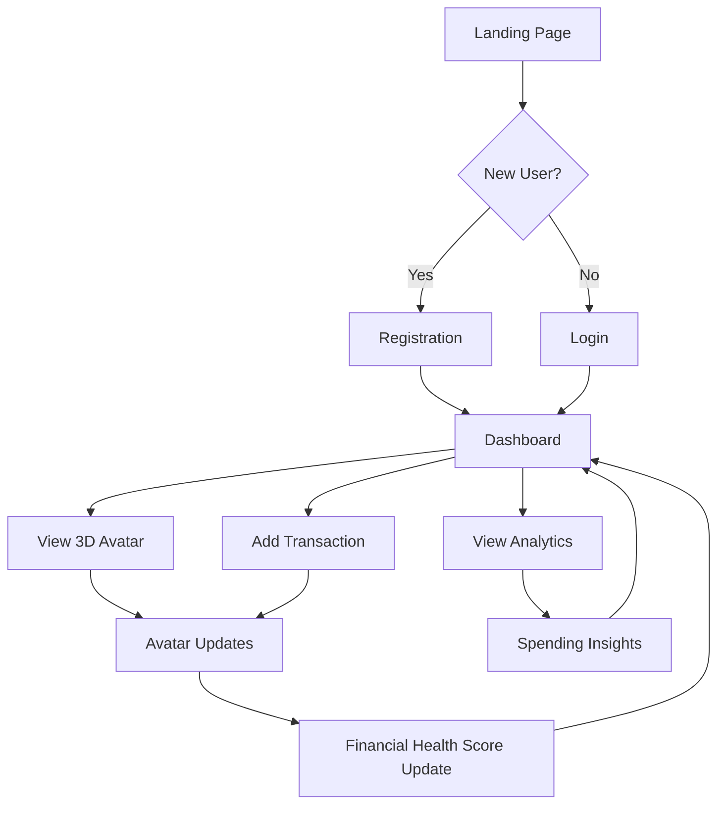

## 1. Product Overview

A personal financial management app that visualizes spending habits through an interactive 3D human avatar. The avatar's appearance changes based on financial behavior - becoming fitter for healthy spending on exercise/wellness, or heavier for excessive food spending. This gamified approach makes financial tracking engaging and provides immediate visual feedback on financial health decisions.

Target users: Young adults (18-35) who want to improve their financial habits through visual feedback and gamification.

## 2. Core Features

### 2.1 User Roles

| Role          | Registration Method  | Core Permissions                                                                 |
| ------------- | -------------------- | -------------------------------------------------------------------------------- |
| Standard User | Email registration   | Create/read/update own financial data, customize avatar, view analytics          |
| Premium User  | Subscription upgrade | Advanced analytics, custom categories, avatar customization options, export data |

### 2.2 Feature Module

Our financial health app consists of the following main pages:

1. **Landing Page**: Hero section with 3D avatar demo, feature overview, login/signup forms
2. **Dashboard**: Interactive 3D avatar display, spending overview, quick stats, recent transactions
3. **Transactions**: Add/edit/delete transactions, categorize spending, bulk import
4. **Analytics**: Spending trends, category breakdown, financial health score, avatar evolution timeline
5. **Profile**: User settings, avatar customization, notification preferences, account management

### 2.3 Page Details

| Page Name    | Module Name            | Feature description                                                                                                                                                                                                                                                                                                                              |
| ------------ | ---------------------- | ------------------------------------------------------------------------------------------------------------------------------------------------------------------------------------------------------------------------------------------------------------------------------------------------------------------------------------------------ |
| Landing Page | Hero Section           | Display animated 3D avatar that transforms based on different spending patterns. Show before/after scenarios.                                                                                                                                                                                                                                    |
| Landing Page | Feature Overview       | Highlight key features with icons and brief descriptions of financial tracking and avatar visualization.                                                                                                                                                                                                                                         |
| Landing Page | Authentication         | Email/password login and registration forms with validation and error handling.                                                                                                                                                                                                                                                                  |
| Dashboard    | 3D Avatar Display      | Interactive 3D character, with an option to select gender of character, that updates in real-time based on spending data. Rotate, zoom, and click for details. Avatar updates by looking more or less healthy depending on spending data, it will gain or lose hair, it will gain or lose muscle definition.  and add the user can change gender |
| Dashboard    | Spending Overview      | Current month spending total, budget remaining, top spending categories with progress bars.                                                                                                                                                                                                                                                      |
| Dashboard    | Quick Stats            | Financial health score, spending trend indicator, savings rate, debt-to-income ratio if applicable.                                                                                                                                                                                                                                              |
| Dashboard    | Recent Transactions    | Last 5 transactions with category icons, amounts, and merchant names. Click to view all.                                                                                                                                                                                                                                                         |
| Transactions | Add Transaction        | Form with amount, category, description, date, and receipt upload. Auto-categorize based on merchant.                                                                                                                                                                                                                                            |
| Transactions | Transaction List       | Searchable and filterable list with edit/delete actions, bulk operations, and export functionality.                                                                                                                                                                                                                                              |
| Transactions | Category Management    | Create custom categories with colors and icons, set monthly budgets for each category.                                                                                                                                                                                                                                                           |
| Analytics    | Spending Trends        | Line chart showing spending patterns over time with category breakdown toggle.                                                                                                                                                                                                                                                                   |
| Analytics    | Category Analysis      | Pie/donut charts showing spending distribution with drill-down capabilities.                                                                                                                                                                                                                                                                     |
| Analytics    | Avatar Evolution       | Timeline showing how avatar appearance changed over time with spending correlation.                                                                                                                                                                                                                                                              |
| Analytics    | Financial Health Score | Comprehensive score calculation with factors: spending habits, savings rate, budget adherence, debt management.                                                                                                                                                                                                                                  |
| Profile      | User Settings          | Update personal information, change password, notification preferences.                                                                                                                                                                                                                                                                          |
| Profile      | Avatar Customization   | Choose base avatar appearance, customize clothing colors, accessories (premium feature).                                                                                                                                                                                                                                                         |
| Profile      | Data Export            | Export transactions to CSV/PDF, backup data, privacy settings.                                                                                                                                                                                                                                                                                   |

 

## 3. Core Process

### User Registration Flow:

1. User visits landing page and sees 3D avatar demonstration
2. Clicks "Get Started" and fills registration form
3. System creates account with default categories and neutral avatar state
4. User is redirected to dashboard with tutorial overlay

### Daily Usage Flow:

1. User logs in to view dashboard with updated 3D avatar
2. Avatar appearance reflects current financial health based on recent spending
3. User can add new transactions via quick-add or full transaction page
4. System automatically updates avatar based on spending patterns
5. User can explore analytics to understand spending impact on avatar

### Avatar Health Calculation:

1. System analyzes spending categories and amounts
2. Healthy categories (exercise, education, savings) improve fitness metrics
3. Unhealthy categories (junk food, excessive dining) negatively impact health metrics
4. Avatar appearance updates in real-time with smooth transitions
5. Users can see correlation between spending and avatar changes in analytics

## 4. User Interface Design

### 4.1 Design Style

* **Primary Colors**: Lavander (#BF94E4) for trust, emerald (#10B981) for financial health

* **Secondary Colors**: Warm orange (#F59E0B) for warnings, red (#EF4444) for overspending

* **Button Style**: Rounded corners (8px radius), subtle shadows, hover animations

* **Typography**: Inter font family, 16px base size, clear hierarchy with font weights

* **Layout**: Card-based design with consistent spacing (8px grid system)

* **Icons**: Line-style icons from Lucide React, consistent 24px size

* **3D Avatar**: Cartoon-styled, friendly appearance with smooth animations

### 4.2 Page Design Overview

| Page Name    | Module Name       | UI Elements                                                                                                  |
| ------------ | ----------------- | ------------------------------------------------------------------------------------------------------------ |
| Landing Page | Hero Section      | Full-width gradient background with animated 3D avatar center stage, floating cards showing feature previews |
| Dashboard    | 3D Avatar Display | Large avatar viewport (60% width) with rotation controls, health status bars overlay, emotion indicators     |
| Dashboard    | Spending Cards    | Horizontal card layout with category icons, progress rings, tap for detailed view                            |
| Transactions | Add Form          | Clean form with large input fields, category selector with icons, drag-drop receipt upload                   |
| Analytics    | Charts            | Full-width responsive charts with interactive legends, date range picker, export buttons                     |
| Profile      | Settings          | Organized sections with toggle switches, avatar preview sidebar, save confirmation                           |

### 4.3 Responsiveness

* **Desktop-first** approach with breakpoints at 1280px, 1024px, 768px, and 640px

* **Mobile adaptations**: Collapsible navigation, stacked cards, touch-friendly controls

* **Touch optimizations**: Larger tap targets (minimum 44px), swipe gestures for avatar rotation

* **Performance**: Progressive enhancement, lazy loading for 3D assets, offline capability for core features

